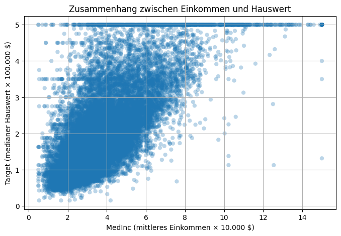
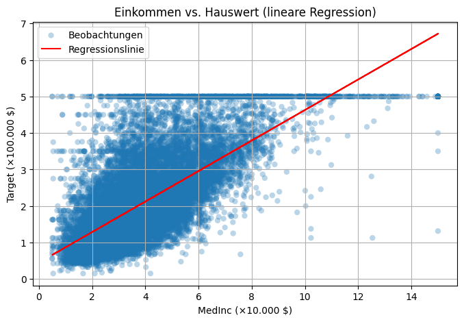
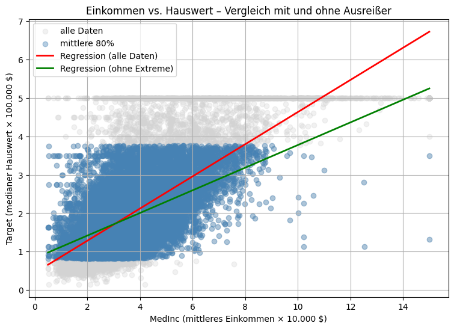

```python
from sklearn.datasets import fetch_california_housing
import pandas as pd

# Datensatz laden
data = fetch_california_housing()

# In DataFrame umwandeln
df = pd.DataFrame(data.data, columns=data.feature_names)
df["Target"] = data.target  # Median House Value in 100.000 $

print(df.head())

```

       MedInc  HouseAge  AveRooms  AveBedrms  Population  AveOccup  Latitude  \
    0  8.3252      41.0  6.984127   1.023810       322.0  2.555556     37.88   
    1  8.3014      21.0  6.238137   0.971880      2401.0  2.109842     37.86   
    2  7.2574      52.0  8.288136   1.073446       496.0  2.802260     37.85   
    3  5.6431      52.0  5.817352   1.073059       558.0  2.547945     37.85   
    4  3.8462      52.0  6.281853   1.081081       565.0  2.181467     37.85   
    
       Longitude  Target  
    0    -122.23   4.526  
    1    -122.22   3.585  
    2    -122.24   3.521  
    3    -122.25   3.413  
    4    -122.25   3.422  


2. Beantwortung der Fragen;
Wie alt sind die Häuser?


```python
median_age = df["HouseAge"].median()
q75_age = df["HouseAge"].quantile(0.75)

print("Medianes Alter der Häuser:", median_age)
print("75. Perzentil (oberes Viertel):", q75_age)

```

    Medianes Alter der Häuser: 29.0
    75. Perzentil (oberes Viertel): 37.0


Häuser mit den meisten Räumen


```python
max_rooms = df["AveRooms"].max()
most_spacious = df[df["AveRooms"] == max_rooms]

print("Maximale durchschnittliche Zimmerzahl:", max_rooms)
print("Beispielzeile:\n", most_spacious.head(1))

```

    Maximale durchschnittliche Zimmerzahl: 141.9090909090909
    Beispielzeile:
           MedInc  HouseAge    AveRooms  AveBedrms  Population  AveOccup  Latitude  \
    1914   1.875      33.0  141.909091  25.636364        30.0  2.727273     38.91   
    
          Longitude   Target  
    1914     -120.1  5.00001  


Wie viel verdienen die Bewohner der nördlichsten Häuser?


```python
north_lat = df["Latitude"].max()
north_houses = df[df["Latitude"] == north_lat]

mean_income_north = north_houses["MedInc"].mean()
print("Breitengrad der nördlichsten Häuser:", north_lat)
print("Durchschnittseinkommen (×10.000 $):", mean_income_north)
print("→ Das entspricht ca.", mean_income_north * 10_000, "USD")

```

    Breitengrad der nördlichsten Häuser: 41.95
    Durchschnittseinkommen (×10.000 $): 2.0496
    → Das entspricht ca. 20496.0 USD


Wie viele Menschen wohnen in einem Haus in dem am dünnsten besiedelsten Gebiet


```python
min_pop = df["Population"].min()
thin_area = df[df["Population"] == min_pop]

mean_occupancy = thin_area["AveOccup"].mean()
print("Geringste Bevölkerungszahl:", min_pop)
print("Bewohner pro Haus im dünnsten Gebiet:", mean_occupancy)

```

    Geringste Bevölkerungszahl: 3.0
    Bewohner pro Haus im dünnsten Gebiet: 0.75


3. Suche nach Missing Values oder None-Werten im Datensatz


```python
from sklearn.datasets import fetch_california_housing
import pandas as pd

# 1) Datensatz laden und in DataFrame umwandeln
data = fetch_california_housing()
df = pd.DataFrame(data.data, columns=data.feature_names)
df["Target"] = data.target


# 2) Fehlende Werte pro Spalte zählen
print("Fehlende Werte je Spalte:")
print(df.isnull().sum())

# 3) Gibt es überhaupt fehlende Werte?
has_missing = df.isnull().values.any()
total_missing = int(df.isnull().sum().sum())
print("\nGibt es fehlende Werte (NaN/None)?", has_missing)
print("Gesamtzahl fehlender Werte im gesamten DataFrame:", total_missing)

# 4) schnelle Strukturübersicht (zeigt 'non-null' Counts)
print("\nDataFrame-Info:")
df.info()
```

    Fehlende Werte je Spalte:
    MedInc        0
    HouseAge      0
    AveRooms      0
    AveBedrms     0
    Population    0
    AveOccup      0
    Latitude      0
    Longitude     0
    Target        0
    dtype: int64
    
    Gibt es fehlende Werte (NaN/None)? False
    Gesamtzahl fehlender Werte im gesamten DataFrame: 0
    
    DataFrame-Info:
    <class 'pandas.core.frame.DataFrame'>
    RangeIndex: 20640 entries, 0 to 20639
    Data columns (total 9 columns):
     #   Column      Non-Null Count  Dtype  
    ---  ------      --------------  -----  
     0   MedInc      20640 non-null  float64
     1   HouseAge    20640 non-null  float64
     2   AveRooms    20640 non-null  float64
     3   AveBedrms   20640 non-null  float64
     4   Population  20640 non-null  float64
     5   AveOccup    20640 non-null  float64
     6   Latitude    20640 non-null  float64
     7   Longitude   20640 non-null  float64
     8   Target      20640 non-null  float64
    dtypes: float64(9)
    memory usage: 1.4 MB


4. missing values ersetzen --> es gibt keine

5. Streudiagramm zwischen Einkommen und Verkaufswert der Häuser. Berechnen Sie auch die Korrelation.


```python
from sklearn.datasets import fetch_california_housing
import pandas as pd
import matplotlib.pyplot as plt

# 1) Datensatz laden
data = fetch_california_housing()
df = pd.DataFrame(data.data, columns=data.feature_names)
df["Target"] = data.target  # medianer Hauswert (×100.000 $)

# 2) Streudiagramm zwischen Einkommen und Hauswert
plt.figure(figsize=(8, 5))
plt.scatter(df["MedInc"], df["Target"], alpha=0.3, edgecolor="none")
plt.title("Zusammenhang zwischen Einkommen und Hauswert")
plt.xlabel("MedInc (mittleres Einkommen × 10.000 $)")
plt.ylabel("Target (medianer Hauswert × 100.000 $)")
plt.grid(True)
plt.show()

# 3) Korrelation berechnen (Pearson)
correlation = df["MedInc"].corr(df["Target"])
print(f"Korrelation zwischen Einkommen und Hauswert: {correlation:.3f}")

```


    

    


    Korrelation zwischen Einkommen und Hauswert: 0.688


6. Regressionsanalyse; Teil A


```python
from sklearn.datasets import fetch_california_housing
import pandas as pd
import matplotlib.pyplot as plt
from sklearn.linear_model import LinearRegression
import numpy as np

# 1) Datensatz laden
data = fetch_california_housing()
df = pd.DataFrame(data.data, columns=data.feature_names)
df["Target"] = data.target  # medianer Hauswert (×100.000 $)

# 2) Eingangs- und Zielvariable definieren
X = df[["MedInc"]]  # Einkommen (×10.000 $)
y = df["Target"]  # Hauswert (×100.000 $)

# 3) Lineare Regression trainieren
model = LinearRegression()
model.fit(X, y)

# 4) Kennwerte berechnen
r2 = model.score(X, y)
slope = model.coef_[0]
intercept = model.intercept_

print("LINEARE REGRESSION: Hauswert = β0 + β1 * Einkommen\n")
print(f"β0 (Achsenabschnitt): {intercept:.3f}")
print(f"β1 (Steigung):        {slope:.3f}")
print(f"Bestimmtheitsmaß R²:  {r2:.3f}")

# 5) Streudiagramm mit Regressionslinie
plt.figure(figsize=(8, 5))
plt.scatter(X, y, alpha=0.3, edgecolor="none", label="Beobachtungen")
plt.plot(X, model.predict(X), color="red", label="Regressionslinie")
plt.title("Einkommen vs. Hauswert (lineare Regression)")
plt.xlabel("MedInc (×10.000 $)")
plt.ylabel("Target (×100.000 $)")
plt.legend()
plt.grid(True)
plt.show()

```

    LINEARE REGRESSION: Hauswert = β0 + β1 * Einkommen
    
    β0 (Achsenabschnitt): 0.451
    β1 (Steigung):        0.418
    Bestimmtheitsmaß R²:  0.473


    

    


6. Regressionsanalyse; Teil B


```python
from sklearn.datasets import fetch_california_housing
import pandas as pd
import matplotlib.pyplot as plt
from sklearn.linear_model import LinearRegression

# 1) Datensatz laden
data = fetch_california_housing()
df = pd.DataFrame(data.data, columns=data.feature_names)
df["Target"] = data.target  # medianer Hauswert (×100.000 $)

# 2) Grundmodell (mit allen Daten)
X = df[["MedInc"]]
y = df["Target"]

model_full = LinearRegression()
model_full.fit(X, y)

r2_full = model_full.score(X, y)
slope_full = model_full.coef_[0]
intercept_full = model_full.intercept_

print("🔹 REGRESSION – ALLE DATEN")
print(f"β₀ (Intercept): {intercept_full:.3f}")
print(f"β₁ (Steigung):  {slope_full:.3f}")
print(f"R²:             {r2_full:.3f}")

# 3) Extremwerte (oberste & unterste 10%) entfernen
lower = df["Target"].quantile(0.10)
upper = df["Target"].quantile(0.90)
df_trim = df[(df["Target"] >= lower) & (df["Target"] <= upper)]

X_trim = df_trim[["MedInc"]]
y_trim = df_trim["Target"]

model_trim = LinearRegression()
model_trim.fit(X_trim, y_trim)

r2_trim = model_trim.score(X_trim, y_trim)
slope_trim = model_trim.coef_[0]
intercept_trim = model_trim.intercept_

print("\nREGRESSION – OHNE EXTREME (mittlere 80%)")
print(f"β₀ (Intercept): {intercept_trim:.3f}")
print(f"β₁ (Steigung):  {slope_trim:.3f}")
print(f"R²:             {r2_trim:.3f}")

# 4) Vergleichsgrafik beider Regressionen
plt.figure(figsize=(9,6))
plt.scatter(df["MedInc"], df["Target"], color="lightgray", alpha=0.3, label="alle Daten")
plt.scatter(df_trim["MedInc"], df_trim["Target"], color="steelblue", alpha=0.4, label="mittlere 80%")

# Linien zeichnen – jetzt mit Spaltennamen
x_vals = pd.DataFrame(sorted(df["MedInc"].unique()), columns=["MedInc"])
plt.plot(x_vals, model_full.predict(x_vals), color="red", lw=2, label="Regression (alle Daten)")
plt.plot(x_vals, model_trim.predict(x_vals), color="green", lw=2, label="Regression (ohne Extreme)")

plt.title("Einkommen vs. Hauswert – Vergleich mit und ohne Ausreißer")
plt.xlabel("MedInc (mittleres Einkommen × 10.000 $)")
plt.ylabel("Target (medianer Hauswert × 100.000 $)")
plt.legend()
plt.grid(True)
plt.show()


```

    🔹 REGRESSION – ALLE DATEN
    β₀ (Intercept): 0.451
    β₁ (Steigung):  0.418
    R²:             0.473
    
    REGRESSION – OHNE EXTREME (mittlere 80%)
    β₀ (Intercept): 0.830
    β₁ (Steigung):  0.294
    R²:             0.312


    

    

